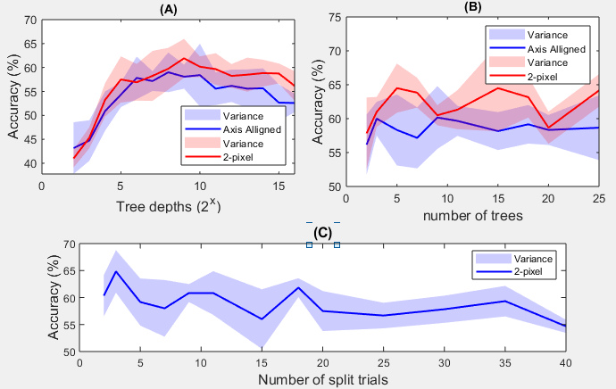

# A Random Forest Based Image Classification Model

This repository includes different random forest algorithms do classification on 10 image classes in Caltech 101 dataset. The details of the architecture, implementation and results are given in [Report.pdf](Report.pdf).

## Description

The description of the work done for this repo was given in [CourseworkDescription.pdf](CourseworkDescription.pdf).

The random forest algorithm was trained on the bag-of-visual-words (BOW) vector represantation of images of different classes. An available library (vlfeat-0.9.21) was used to extract local image descriptors, and two different methods (k-means clustering, random forest) of BOW generation was used. Then, two versions of weaks learners (axis alligned, 2-pixel test) was used in the classification random forest. The different scripts for different implementations can be found in [/internal](/internal) folder.

## Results

Our implementation of different random forest architectures suggest that using k-means clustering for BOW generation and random forest with axis alligned weak learner performs the best for this task. The optimal result for each method are shown below:

| Clustering, Classifying methods | Test Accuracy |
|:-------|:-------:|
| k-means, axis alligned| **73.4%** |
| k,means, 2-pixel| 72.1% |
| random forest, axis alligned| 59.2% |
| random forest, 2-pixel| 64% |

The effects of different parameters on the classification accuracy for the model with random forest clustering was shown on the figure below:

## Dependencies

- Matlab 
- vlfeat-0.9.21

## Quick guide

1. Download the required vlfeat library for Matlab from http://www.vlfeat.org/. It should be put in the [/external](/external) folder.

2. Run the [MasterCode.m](MasterCode.m) script on Matlab.
